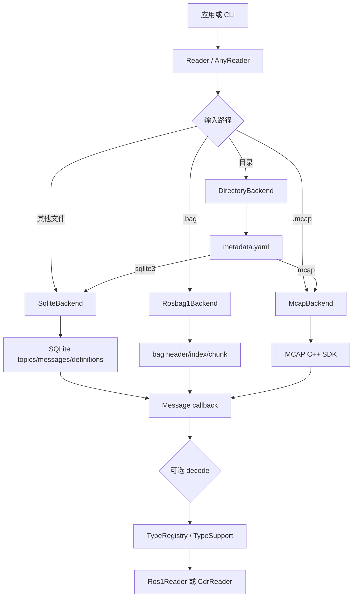

# rosbags-cpp 落盘方案与程序架构

本文档描述 `rosbags-cpp` 的落盘方案、模块边界和一次读取请求的完整路径。文档以当前仓库实现为准，源码位置见文末的源文件索引。

## 1. 目标与边界

### 1.1 目标

- 在不初始化 ROS 的普通 C++17 程序中读取 ROS1 bag v2.0、ROS2 SQLite3 和 ROS2 MCAP。
- 用一个 `Reader` API 暴露存储元数据、连接信息、原始序列化字节和可选的类型解码。
- 对 ROS2 bag 目录的 `metadata.yaml`、多文件存储和 zstd 文件/消息压缩提供统一处理。
- 将格式后端、序列化读取器和类型注册解耦，允许应用只链接需要的 profile 和生成代码。
- 在配置阶段将 MCAP 设置为可选依赖；默认启用时自动获取并编译 MCAP C++ SDK。

### 1.2 非目标

- 当前库是只读实现，不负责写 bag、转换格式、播放消息或发布 ROS topic。
- 不提供 ROS 类型支持包的运行时发现；自定义消息需要应用提供定义并预先生成 C++ 代码。
- `.msg` 和 IDL 生成器覆盖常见字段，不等同于完整 ROS 接口编译器。
- ROS1 加密 bag、未知压缩算法和不受支持的序列化格式会明确报错。

## 2. 对外数据契约

公共接口位于 `include/rosbags/rosbags.hpp`。

| 类型 | 作用 |
| --- | --- |
| `Reader` | 读取一个文件或一个 ROS2 bag 目录。 |
| `AnyReader` | 读取多个同一 ROS 世代的输入，按时间戳合并消息。 |
| `ReaderMetadata` | 存储类型、起止时间、持续时间、总消息数、压缩信息和实际文件列表。 |
| `Connection` | topic、规范化类型名、序列化格式、消息定义、摘要、QoS 和消息计数。 |
| `Message` | 时间戳、`Connection` 指针和共享的原始 payload。 |
| `ReadFilter` | topic、连接 ID、起始时间和结束时间过滤器。 |
| `TypeRegistry` | 以 `profile + canonical type` 为键保存 `TypeSupport`。 |
| `DecodedMessage` | 解码对象、类型支持和源消息的关联。 |

时间统一使用纳秒的 `uint64_t`。库的时间窗口采用半开区间 `[start_time, end_time)`：`end_time` 是最后一条消息时间戳加 1，`duration = end_time - start_time`。因此 ROS2 `metadata.yaml` 中有消息时，库内部的 `duration` 会在记录值基础上加 1 纳秒，以保持这个契约。

topic 会去除重复斜杠并保留根斜杠；类型会规范化为 `package/msg/Type`，已经是 `/msg/` 或 `/action/` 形式的类型保持不变。

## 3. 总体架构

实现分为四层：

1. **公共 API 层**：负责生命周期、过滤器、元数据和类型解码入口。
2. **后端层**：每种物理存储实现 `internal::Backend`，只负责发现连接和产出原始消息。
3. **序列化层**：`Ros1Reader`、`CdrReader` 和生成的读取函数将 payload 转换为 C++ 对象。
4. **构建/工具层**：CMake 选择可选依赖，三个 CLI 将公共 API 暴露为检查、读取和生成命令。

## 4. 模块职责

| 文件 | 职责和边界 |
| --- | --- |
| `src/rosbags.cpp` | 根据路径创建后端；实现 `Reader`、`AnyReader`、类型注册、解码策略和名称规范化。 |
| `src/internal.hpp` | 内部字节序函数、边界检查、过滤器、文件读取和 `Backend` 抽象。 |
| `src/rosbag1.cpp` | 解析 ROS1 bag magic、bag header、connection、chunk info、chunk index 和消息记录。 |
| `src/sqlite3.cpp` | 只读打开 SQLite，识别 schema 1-4，读取 topics/definitions/messages；同时实现 ROS2 目录和 zstd 文件/消息处理。 |
| `src/mcap.cpp` | 通过官方 MCAP C++ SDK 读取 summary、schema、channel、statistics 和消息流。禁用 SDK 时只抛出 `UnsupportedFeature`。 |
| `include/rosbags/serialization.hpp` | 提供边界检查、ROS1 标量读取、CDR 封装头/字节序/对齐和字符串读取。 |
| `src/profiles.cpp` | 注册内置 `String`、`Time`、`Duration`、`Vector3`、`Quaternion` 和 `Imu` 的 ROS1/CDR 解码器。 |
| `src/codegen.cpp` | 解析 `.msg`/基础 `.idl`，生成结构体、ROS1/CDR 读取函数和 `TypeRegistry` 注册函数。 |
| `tools/` | `rosbags-info` 输出摘要，`rosbags-read` 输出原始/解码消息，`rosbags-gen` 生成自定义类型。 |
| `CMakeLists.txt` | 控制 SQLite/yaml-cpp/LZ4/zstd/BZip2/MCAP 依赖、目标链接、测试、安装和导出配置。 |

## 5. Reader 生命周期与错误边界

### 5.1 `Reader`

1. 构造函数检查路径存在，并按目录、`.bag`、`.mcap` 或其他后缀选择后端。
2. `open()` 读取索引/元数据和连接信息，成功后才能访问 `metadata()`、`connections()`、`messages()` 和 `read_raw()`。
3. 每个 backend 创建增量 cursor；SQLite 使用有序 prepared statement，ROS1 合并 per-connection 索引，MCAP 使用 log-time order，目录后端合并子 storage cursor。`read_raw()` 只负责排空 cursor。
4. `read_decoded()` 复用 `read_raw()`，对每条消息调用 `decode()`。
5. reader 外壳和 cursor 共享内部状态，因此移动或销毁外壳不会使 cursor 失效；`close()` 是幂等的，并释放 SQLite 句柄、MCAP reader、解压缓存和目录临时文件，显式调用前必须先销毁活跃 cursor。

后端在 `open()` 失败时清理已创建的子资源。格式错误使用 `FormatError`，资源上限使用 `ResourceLimitError`，缺少可选能力使用 `UnsupportedFeature`，类型或 payload 解码失败使用 `DecodeError`，普通 I/O/API 状态使用 `RosbagsError`。

### 5.2 `AnyReader`

`AnyReader` 先打开所有子 `Reader`，拒绝混合 ROS1 与 ROS2，并为每个子 reader 重新分配全局连接 ID。它维护一个以 `(timestamp, 输入顺序)` 排序的最小堆，每次只保留每个输入的一条当前消息；同时间戳仍按输入顺序和子 reader 的稳定顺序输出。它不再收集或排序全量 payload。外壳和 cursor 共享内部状态，所以移动或销毁外壳不会留下悬空引用；显式 `close()` 前仍必须销毁共享该状态的 cursor。

## 6. 各存储后端

### 6.1 ROS1 bag

`Rosbag1Backend` 的打开流程如下：

1. 校验 `#ROSBAG V2.0` magic。
2. 读取带长度前缀的 bag header，取得 `index_pos`、连接数和 chunk 数。
3. 从 `index_pos` 读取 connection header；connection 数据体是字段序列本身，不再包含一层 header 长度。
4. 读取每个 `CHUNK_INFO`，建立 chunk 位置、时间范围和 index record 数。
5. 按 chunk 读取 `CHUNK` header 和 `IDXDATA`；文件内容不保留在内存，索引项紧凑保存时间戳、chunk 序号和消息偏移。
6. cursor 以每连接一个堆项合并索引，按需 seek 并流式解压一个 chunk，跳过 chunk 内的 connection record，再校验目标记录是 `MSGDATA`。

支持的 chunk 压缩为 `none`、`lz4`，以及在找到 BZip2 开发库时的 `bz2`。LZ4/BZip2 使用定长 I/O buffer 流式解压；默认 256 MiB 的解压上限可由 `ReaderOptions` 调整。ROS1 payload 原样返回；ROS1 内置 `Header` 解码包含 legacy `seq` 字段。

### 6.2 ROS2 SQLite3 文件

`SqliteBackend` 以 `SQLITE_OPEN_READONLY` 打开文件，检查 `topics` 和 `messages` 表后识别 schema：

- 有 `schema` 表时读取 `schema_version`，支持 1-4；
- 没有 `schema` 表时，根据 `topics.offered_qos_profiles` 推断旧 schema 1 或 2；
- schema 4 额外读取 `message_definitions` 和 `type_description_hash`。

消息查询使用 `topics JOIN messages`，按 `messages.timestamp, messages.id` 排序，并将 `ReadFilter` 转换为 topic ID、起止时间 SQL 条件。SQLite blob 在每条回调时复制到共享 `Bytes`，不会把整个消息表一次性载入内存。

### 6.3 ROS2 bag 目录

`DirectoryBackend` 先解析目录中的 `metadata.yaml`：

1. 校验 `rosbag2_bagfile_information`、metadata version 和 `storage_identifier`。
2. 从 `topics_with_message_count` 建立目录级连接、QoS、类型摘要和计数。
3. 根据 `relative_file_paths` 定位子文件；当前实现按 rosbag2 常见约定使用文件名部分。
4. 为每个 SQLite 或 MCAP 子文件创建对应后端，并把后端连接定义补回目录连接。
5. 读取时将子后端消息映射回目录连接，并应用 topic/时间过滤。

zstd 处理边界：

- `compression_mode: file`：先解压到临时文件，再由 SQLite/MCAP 后端打开；
- `compression_mode: message`：每条消息读取后解压 payload；
- 其他 compression mode（包括 `storage`）当前会明确拒绝，避免把未解压数据交给底层后端后产生误导性的格式错误。

### 6.4 MCAP

启用 MCAP 后，`McapBackend` 使用 SDK 的 `McapReader`：

- `open()` 后读取 summary，必要时允许 SDK fallback scan；
- 从 channels/schemas 生成 `Connection` 和 message definition；
- 从 statistics 设置总消息数、起止时间和每 channel 计数；
- `read_raw()` 使用 log-time order、topic predicate 和 `[start,end)` 时间选项；
- SDK 的消息扫描错误通过 `FormatError` 返回。

MCAP 依赖由 CMake 按 `ROSBAGS_MCAP_ROOT`、已安装 `mcap` 包、FetchContent `mcap_builder` 的顺序解析。目标链接和安装导出见 `CMakeLists.txt` 与 `cmake/rosbags_cppConfig.cmake.in`。

## 7. 序列化与类型系统

### 7.1 原始读取

后端只负责取得 `(timestamp, connection, bytes)`。它不根据类型定义解释 payload，因此未知消息类型仍可通过 `read_raw()` 使用。

### 7.2 ROS1 与 CDR

- `Ros1Reader` 按 little-endian 读取标量，字符串为长度加字节，不做 CDR 对齐；
- `CdrReader` 校验 4 字节 encapsulation header，识别端序；字段对齐基准从封装头之后开始；
- 两种 reader 都在每次读取前检查剩余长度，`finish()` 要求 payload 恰好消费完；
- 不支持的 `serialization_format` 不会静默当作另一种格式处理。

### 7.3 `TypeRegistry` 与策略

`TypeRegistry` 的 key 是 `profile + "\\n" + normalize_type(type)`。`decode()` 找不到类型时按 `UnknownTypePolicy` 处理：

| 策略 | 行为 |
| --- | --- |
| `WarnAndSkip` | 触发 warning（如果提供），返回空 optional。`read_decoded()` 不调用用户回调。 |
| `WarnAndRaw` | 触发 warning，返回 `raw_only()` 的 `DecodedMessage`，其中 `source` 指向原始消息。 |
| `Error` | 直接抛出 `DecodeError`。 |

注册成功后，`TypeSupport<T>` 保存 ROS1 decoder、CDR decoder 和可选文本格式化器；应用通过 `DecodedMessage::as<T>()` 取得强类型对象。

## 8. 自定义消息生成架构

`rosbags-gen` 将输入定义归一化为：包名、消息名、canonical 类型名和字段列表，然后生成两个头文件：

- `<profile>_messages.hpp`：结构体、ROS1/CDR 读取函数和反序列化入口；
- `<profile>_registry.hpp`：将每个类型注册到指定 profile 的 `register_types()`。

`.msg` 支持基本类型、定长数组、无界/有界序列和嵌套消息。IDL 解析器支持基础 `struct`、字段数组、`sequence<T>` 和常见 primitive 别名。包名由 `msg`/`idl` 父目录推导，生成前应保持标准的 `package/msg/*.msg` 或 `package/idl/*.idl` 布局。

## 9. 构建、安装与运行时关系

构建目标为 `rosbags_cpp::rosbags_cpp`，公共依赖为 SQLite3、yaml-cpp、pkg-config 导入的 LZ4/zstd；BZip2 和 MCAP 按配置决定。`ROSBAGS_HAS_BZ2`、`ROSBAGS_HAS_MCAP` 以 public compile definition 传给应用，使 `mcap.cpp` 在未启用时不包含 SDK 头文件。

安装会导出 `rosbags_cpp::rosbags_cpp` 和头文件。MCAP 自动获取时，`mcap_builder` 的安装目标也进入同一次安装；生成的 `rosbags_cppConfig.cmake` 会在非外部 SDK 模式下先加载 `mcap` CMake 依赖。

## 10. 已知限制与后续扩展点

- `AnyReader` 的内存随输入数量、每路当前 payload 和每个 ROS1 输入最近使用的一个 chunk 增长，而不是随总 payload 增长；大量超大并行输入仍应按任务拆分。
- ROS1 不再整包载入内存；精确排序仍要求常驻 `IDXDATA` 索引，单个解压 chunk 受 `ReaderOptions::max_rosbag1_chunk_bytes` 约束。
- 当前没有 writer、转换器、ROS graph 发布器或动态类型支持加载器。
- 基础 IDL 生成器不处理完整 IDL module、常量语义、注解和所有 ROS action/service 结构。
- ROS1 读取要求 bag 已建立索引；未索引 bag 和加密 bag 当前不支持。
- MCAP 压缩能力取决于实际链接的 MCAP SDK 构建选项；应在目标环境中用压缩样本单独验证。

## 11. 源文件索引

- 公共接口：[include/rosbags/rosbags.hpp](../include/rosbags/rosbags.hpp)
- 内部后端契约：[src/internal.hpp](../src/internal.hpp)
- Reader 和解码：[src/rosbags.cpp](../src/rosbags.cpp)
- ROS1：[src/rosbag1.cpp](../src/rosbag1.cpp)
- SQLite3/ROS2 目录：[src/sqlite3.cpp](../src/sqlite3.cpp)
- MCAP：[src/mcap.cpp](../src/mcap.cpp)
- 序列化：[include/rosbags/serialization.hpp](../include/rosbags/serialization.hpp)
- 内置 profile：[include/rosbags/profiles.hpp](../include/rosbags/profiles.hpp)、[src/profiles.cpp](../src/profiles.cpp)
- 自定义类型生成：[include/rosbags/codegen.hpp](../include/rosbags/codegen.hpp)、[src/codegen.cpp](../src/codegen.cpp)
- CLI：[tools/rosbags_info.cpp](../tools/rosbags_info.cpp)、[tools/rosbags_read.cpp](../tools/rosbags_read.cpp)、[tools/rosbags_gen.cpp](../tools/rosbags_gen.cpp)
